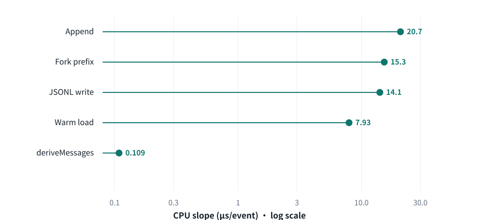
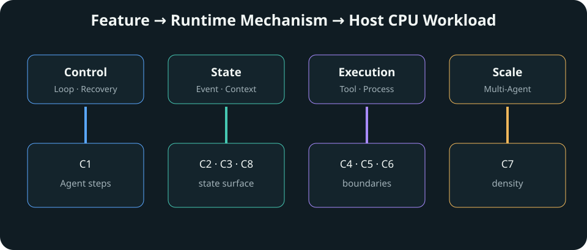

# DeepSeek Harness 新型 Agent Harness 机制调研

> DeepSeek Harness 有哪些新的 Agent Harness 设计，这些设计如何工作，与当前 pinned OpenClaw 有哪些已验证差异，以及这些变化进一步给 Host CPU 带来什么工作负载。

## 0. 执行摘要

DeepSeek Harness 的关键变化，不是再给一个传统 ReAct 循环增加更多工具，而是重新组织 Agent Harness 的运行时边界。模型仍负责推理、规划、生成和决定下一步；Harness 则负责把这些决定变成持续、可记录、可恢复的执行。当前 pinned 源码把模型适配器、工具注册表、Session 日志和 Agent Loop 等能力放进由 Cordis 驱动的 everything-is-a-plugin composition，并通过 `ctx.*` service/capability 接口让 consumer 与具体 provider 分离。这种设计并不意味着任意组件都能零成本互换，但它让运行时能力及其边界更显式。

第一项重要变化是 capability/provider 的组合方式。文件工具不必直接绑定某个文件系统实现，而可以经由 `ctx.fs` 使用不同 provider。W10 保持 Agent Loop、`tool-fs` consumer 和 scripted calls 不变，仅将 provider 从 local 切换到 sandbox，再切回 local；workspace 外写入由 `{{W10_LOCAL_OUTSIDE}}` 变为 `{{W10_SANDBOX_ERROR}}`，切回后的行为恢复为 `{{W10_SWAP_RESTORED}}`。这说明当前 revision 中 `ctx.fs` 是一个可观察的 provider boundary，而非仅存在于架构图中的接口。

第二项变化是把 Session 明确建模为 durable execution state。DeepSeek Harness 使用 append-only typed event log 保存 turn、message、tool call/result 和 step 边界，再由 `deriveMessages()` 生成模型所见的 Context。W9 对 crash/resume、fork 和 replay 的验证表明：已提交前缀保持不变，悬空 tool call 不被重新 dispatch，Runtime 注入 `{{W9_SYNTHETIC_ERROR}}` 后关闭中断的 turn 并从新 turn 继续；closed-turn boundary 可以派生 child Session；记录的 model stream 可以在不访问 live provider 的条件下 replay。这里证明的是 pinned semantics，而不是“任意现实副作用都能自动重放”。

第三项变化是 Context Management 成为可组合的 Runtime capability。长任务中，Runtime 不只统计 token，还要构造当前 surface、估算 pressure、决定是否 compact，并生成下一轮模型上下文。`sdk-minimal` 并不默认等价于自动 compaction；W5 显式加载 token-meter 与 compaction-basic 后，在 {{W5_DSH_TOOL_CALLS}} 次工具调用中观察到 {{W5_DSH_COMPACTIONS}} 次压缩，并在压缩后继续完成任务。这说明 compaction 可以进入 composition，但不同 Runtime 的 estimator、request envelope 和 context format 仍不能被简单解释为架构优劣。

第四项变化是 Programmatic Tool Calling（PTC）把逐次 Tool Round Trip 转为一次 Program Execution。W8 固定 {{W8_OPERATIONS}} 个底层 shell operation；DSH Direct 需要 {{W8_DSH_DIRECT_CALLS}} 个 model-visible tool call 和 {{W8_DSH_DIRECT_REQUESTS}} 个 provider request，而 Code Mode 变为 {{W8_DSH_CODE_CALLS}} 个 program call 和 {{W8_DSH_CODE_REQUESTS}} 个 provider request，请求体总量下降 {{W8_DSH_BODY_REDUCTION_PCT}}%。本报告用 **Executor Collapse** 描述这种工作负载变化：底层操作没有消失，模型可见的外层编排粒度被折叠。它是研究术语，不冒充 DeepSeek 官方 Feature 名称。

第五项变化来自 Recovery / Error Semantics。W3 的真实任务现象不足以单独归因；W4 因此固定 malformed provider event，观察到 DSH 将其落为结构化 tool-dispatch error 并发起下一次模型请求，而当前 pinned OpenClaw fixture 以 `{{W4_OPENCLAW_ERROR}}` 终止。W6 又证明 valid tool failure 在两侧都能返回模型并继续。由此更准确的结论是：可靠性取决于 provider boundary、tool execution boundary 和 error semantics 如何协作，而不是某个 Runtime 对所有错误都更强。

这些机制首先是 Harness 设计，CPU 只是进一步影响。C1–C8 显示，插件化 policy、durable state、Context 计价、program runtime 和多 Agent 并发会转化为 Agent Loop、event append/persistence、JSON/SSE serialization、process lifecycle、code runtime、policy enforcement 与 runtime density 等 Host 工作。它们让 Host CPU 从模型请求外围控制器，逐渐承担 Control、State、Execution 和 Scale 四个 Runtime Plane；但当前单机 {{META_HOST_MACHINE}}、每点 {{META_CPU_SAMPLES_PER_POINT}} 个样本的 pilot 与 deterministic mock 不能支持 ISA、厂商或生产性能排名。

| DeepSeek Harness 机制 | 核心变化 | 实验验证 | CPU 对应 |
|---|---|---|---|
| Everything is a Plugin | capability consumer 与 provider 可组合 | W10 | C6 |
| Session Event Log | messages projection 背后是 durable execution state | W9 | C2 / C8 |
| Context Management | TokenMeter / Compaction 进入 Runtime composition | W5 | C8 |
| Code Mode / PTC | Tool round trip 转向 Program execution | W8 | C5 |
| Recovery Semantics | error boundary 决定模型是否获得修复机会 | W4 / W6 | C1 |
| Long Context / Tool State | context 与 result surface 持续增长 | W7 | C3 / C8 |

---

## 1. DeepSeek Harness 是什么

### 1.1 Model 和 Harness 的区别

Model 负责推理、规划、生成，以及决定下一步需要调用什么工具。Harness 负责把决定真正执行起来：发起模型调用、推进 Agent Loop、分发 Tool、保存 Session、构造 Context、处理错误、访问文件系统和进程、运行代码并实施 Policy。两者协同工作，但不应把所有运行时行为都归因于模型。


一个“运行测试、找到 Bug、修改代码并再次验证”的任务会跨越多轮模型决定和本地执行。模型决定先运行测试；Harness 创建进程并记录结果；模型根据错误决定读取源码；Harness 提供文件内容并应用修改；最后 Harness 再次运行验证。工具之间的状态连续性、错误是否可见以及下一轮模型看到什么，都由 Runtime 路径决定。

### 1.2 DeepSeek Harness 的定位

Pinned DSH 文档把它描述为由 Cordis 驱动的 everything-is-a-plugin architecture。Cordis context 是 service 的仓库：插件通过稳定的 `ctx.<key>` 获取服务，而不是直接导入某个具体实现。架构文档明确列出 `ctx.sessions`、`ctx.tools` 和 `ctx.agentLoop` 等 seam；默认 Agent Loop 本身也是该 composition 中的 driver，而不是整个系统唯一不可替换的中心。

这是一种架构组织方式，不是“所有模块可以任意替换且没有代价”的性能承诺。Provider 是否真正可换、换后语义是否符合预期，仍需要针对具体 seam 验证。本仓库直接验证了 `ctx.fs`，对其他 seam 主要依赖 pinned source/docs 与相关机制实验。

### 1.3 本报告研究什么

本报告不研究 DeepSeek 模型能力，也不做模型 benchmark。研究对象是 DeepSeek Harness 的 Runtime 机制。OpenClaw 在这里是参照实现：它代表已经组合成完整产品路径的成熟 Agent Runtime，帮助观察不同 Harness policy 的可见结果；它不是为了形成简单胜负榜。

源码依据包括 pinned DSH 的 `README.md`、`docs/architecture.md`、Session subsystem、tool execution pipeline、TokenMeter/compaction 与 Code Mode 相关实现。实验依据来自 W1–W10；CPU 延伸依据来自 C1–C8。所有定量值由结果 JSON 自动注入。

---

## 2. 新特性一：Everything is a Plugin / Capability Seam

### 2.1 这个机制是什么

DeepSeek Harness 不把所有 Runtime 能力固定写进 Agent Loop。Cordis composition 将 service、provider、事件与 consumer 组合到共享 context；consumer 通过 `ctx.*` 请求能力，provider 则负责具体行为。当前报告最直接的例子是 `tool-fs → ctx.fs → filesystem provider`。


### 2.2 为什么需要它

完整 Agent Runtime 往往已经把 Tool、filesystem、Session 和 policy 组合进固定执行路径。这并非错误，但当研究者希望更换存储、隔离或执行策略时，consumer 与 provider 的耦合会扩大改动范围。Capability seam 明确表达 `consumer ≠ provider`：上层工具可以保持基本不变，底层 capability 决定操作如何执行和限制。

### 2.3 DeepSeek Harness 怎么实现

Cordis 插件向 context 注册稳定 service key，其他插件按 key 获取服务。对于文件系统，`tool-fs` 是面向模型的 consumer，`ctx.fs` 是 capability 接口，fs-local 与 fs-sandbox 是不同 provider。Lifecycle、依赖和替换由 composition 管理；这比在每个工具函数中直接嵌入路径 policy 更容易识别边界。

### 2.4 与当前 pinned OpenClaw 的差异

OpenClaw 同样拥有 Tool、filesystem、sandbox、Session 和 extensibility，不应被描述成“没有 Runtime 抽象”。当前对比能支持的差异是：DSH 在 pinned architecture 中把 capability/provider seam 暴露为核心 composition 模型；OpenClaw baseline 则使用其已经组合完成的 Agent Runtime 路径。本仓库没有证明两者所有子系统的可替换性孰优孰劣。

### 2.5 本仓库如何验证

W10 保持同一个 Agent Loop、同一个 `tool-fs` consumer 和同一组 scripted calls，只按 `fs-local → fs-sandbox → fs-local` 切换 provider。测试同时操作 workspace 内文件与预先创建、位于 workspace sibling 下的 outside 文件，从而区分正常文件能力与边界 policy。

### 2.6 实际观察

| Provider | workspace 内写入 | workspace 外写入 |
|---|---|---|
| fs-local | 成功 | `{{W10_LOCAL_OUTSIDE}}` |
| fs-sandbox | 成功 | `{{W10_SANDBOX_ERROR}}` |
| 再切回 fs-local | 成功 | 行为恢复：{{W10_SWAP_RESTORED}} |

因此，`ctx.fs` 在当前 pinned revision 中确实构成可观察的 Runtime provider boundary。W10 证明的是具体 seam 的替换行为，而不是对所有插件做普遍证明。

### 2.7 对 Host CPU 的延伸

Capability 与 policy 不是纯配置。路径进入 provider 后仍要执行 normalization、canonicalization、containment check 和 policy decision。C6 在 {{C6_OPERATION_COUNT}} 次允许写入下记录的 sandbox/local wall 比为 {{C6_WALL_RATIO_SELECTED}}×，CPU 比为 {{C6_CPU_RATIO_SELECTED}}×。这些数字只用于说明 policy 有可测量执行成本。

### 2.8 当前没有证明什么

C6 不是 container、seccomp、Firecracker 或远程 E2B sandbox benchmark；它也没有证明插件化本身总会提高性能。这里成立的结论只有：provider seam 可被行为实验观察，且 policy path 会形成 Host-side 工作。

---

## 3. 新特性二：Session Event Log

### 3.1 这个机制是什么：从 messages 到 execution state

普通聊天系统常把 Session 理解为 `user / assistant / tool` messages 列表。DSH 的 Session abstraction 更底层：append-only `SessionEvent` log 记录 turn/start、user/message、assistant/message、tool/call、tool/result、step/end 和 turn/end 等 typed event。模型看到的 messages 是 `deriveMessages()` 从 durable state 生成的 projection。


核心区别是：**Session 是 durable execution state，messages 是从 state 中派生给模型看的 projection。** Pinned 架构文档还要求 model-visible input 能从日志重建，这把上下文可见性与日志完整性联系起来。

### 3.2 为什么需要它

Agent 运行中会跨越进程、工具和多个 step。只有 messages 很难表达“调用已经提交但结果尚未出现”“哪个 turn 已关闭”“从哪个稳定边界 fork”等执行状态。Append-only log 为 Resume 提供已提交前缀，为 Fork 提供稳定边界，为 Replay 提供记录流，也为 traceability 提供顺序依据。

### 3.3 DeepSeek Harness 怎么实现

`ctx.sessions` 管理 SessionEvent log；Agent Loop 和其他插件追加 typed event；`deriveMessages()` 把事件投影成模型历史。原始 assistant chunk 被保留以支持 replay/UI fidelity。能力来自同一事件流，但 event storage、projection、persistence 和 repair policy 是不同工作，不能把“有日志”简化为一个 JSONL 文件。

### 3.4 与 OpenClaw 的差异

两者都有 Session 与 Context 管理，OpenClaw 也有持久化、resume 和 compaction 路径。本报告不写成“OpenClaw 没有状态系统”。当前可支持的差异是：DSH 把 typed append-only Session Event Log 作为显式 Runtime abstraction，并围绕其 API 建模 Resume、Fork 和 Replay。本仓库没有实现完全对等的 OpenClaw W9，因此不做有/没有式结论。

### 3.5 本仓库如何验证

W9 分为三种 fixture。Crash/Resume 人为制造 `tool/call` 已持久化、对应 `tool/result` 尚未出现时进程终止；Fork 从 closed-turn boundary 创建 child；Replay 使用记录 Session 的 model stream，并将 live endpoint 指向不可达地址，以验证是否需要真实 provider credential。

### 3.6 实际观察

**Crash / Resume。** 已提交 prefix byte-identical：{{W9_PREFIX_IDENTICAL}}；dangling tool call 未重新 dispatch：{{W9_DANGLING_NOT_DISPATCHED}}。Runtime 注入 synthetic `{{W9_SYNTHETIC_ERROR}}`，关闭 interrupted step/turn，再从新 turn 继续。这不是 partial-turn retry，更不是承诺自动重放任意未完成 Tool。

**Fork。** Parent 与 Child 在 closed-turn boundary 的 derived messages 相等：{{W9_FORK_EQUAL}}；共享 prefix 冻结后，两侧可以独立追加。

```text
Shared Prefix
  ├─ Parent → A
  └─ Child  → B
```

**Replay。** llm-replay 从 Session 中重放记录的 model stream/execution projection，未访问 live provider：{{W9_PROVIDER_NOT_CONTACTED}}。它验证模型流重放，不验证现实世界 side effect 的自动再执行。

### 3.7 对 Host CPU 的延伸

Durable state 带来能力，也带来 state-management workload。C2 将 append、deriveMessages、fork prefix、JSONL write 与 warm load 的 event-count slope 分开；C8 则观察长期 surface 上的 pressure accounting。当前 C2 append slope 为 {{C2_APPEND_CPU_US}} μs/event，deriveMessages slope 为 {{C2_DERIVE_MESSAGES_CPU_US}} μs/event，但这些值只属于固定 event shape。



### 3.8 当前没有证明什么

W9 不是 DSH 与 OpenClaw 的等价 Session 性能 benchmark，也没有证明 Event Log 在所有规模下都更快。它证明当前 DSH API 的具体 Resume/Fork/Replay semantics 可以从冻结证据重建。

---

## 4. 新特性三：Context Management / Compaction

### 4.1 这个机制是什么

长 Agent 会不断追加 user、assistant、tool call 和 tool result。Runtime 需要把 durable history 投影成当前 model-visible surface，估算 pressure，在超过策略边界时生成更小的 Context，然后继续执行。因此 Context Management 不只是“token 越来越多”，而是一条持续运行的状态变换路径。

```text
Session grows → Context Projection → TokenMeter → Pressure → Compaction → Smaller Model Context
```

### 4.2 为什么需要它

如果上下文无限增长，请求体、序列化和模型输入都会扩大；如果直接丢弃历史，又可能破坏 Tool call/result adjacency 或任务状态。Runtime 需要在预算、语义连续性和执行成本之间做明确选择。把 TokenMeter 与 compaction 作为 capability，可以让这种选择进入 composition，而不是散落在业务 prompt 中。

### 4.3 DeepSeek Harness 怎么实现

Pinned DSH 提供 token-meter service 与 compaction-basic provider。TokenMeter 维护/测量当前 surface，compaction-basic 在 Agent lifecycle 的相应 hook 上判断 pressure 并生成压缩结果。必须强调：`sdk-minimal` 默认并不等价于 automatic compaction；W5 是显式加载相关 service 后的机制验证。

### 4.4 与当前 pinned OpenClaw 的差异

OpenClaw 有自己的 context/compaction path。W5 通过校准不同有效预算，让两边在相同 tool-chain ordinal 附近触发压缩，以便观察 request envelope 与 context shaping；它没有把 estimator、prompt format 或 threshold 差异解释为架构优劣。两边都完成了校准 fixture，且都记录到 {{W5_OPENCLAW_COMPACTIONS}} 次 compaction。

### 4.5 本仓库如何验证

W5 使用 deterministic tool chain，让 Context 持续增长，并记录 agent request、compaction request 及每个 boundary 前后的 body bytes。DSH fixture 包含 {{W5_DSH_TOOL_CALLS}} 次 tool call、{{W5_DSH_COMPACTIONS}} 次 compaction，最终完成：{{W5_DSH_COMPLETED}}。

### 4.6 实际观察

| DSH compaction boundary | 压缩前 Agent body | 压缩后 Agent body | 下降 |
|---|---:|---:|---:|
{{W5_BOUNDARY_ROWS}}

三个 boundary 后的下一次 agent request body 均下降，任务仍继续完成。因此 W5 支持“Context Management 是可组合 Runtime capability”，但不支持“某一套压缩内容质量普遍更好”。

### 4.7 对 Host CPU 的延伸

C8 不是 tokenizer benchmark；它测量 pinned DSH TokenMeter/context-pressure accounting。Cold Replay 需要从 durable history 重建 meter state；Warm Repeat 在没有新 Session event 时仍重新处理当前 surface；Incremental 包含 append one text turn 加 measure。当前 cold/repeat per-surface-node slope 比为 {{C8_COLD_REPEAT_RATIO}}×。


Warm Repeat 成本仍随 surface 增长，说明长期 Agent 会持续产生 state traversal/pricing/clone 一类 Host 工作。Incremental 与 Repeat 接近，则提示少量新增 event 不是当前 steady-state 成本的主要部分。Shape 实验还单独覆盖 text、tool call/result 与 schema surface，避免把所有节点当作完全同质。

### 4.8 当前没有证明什么

上述 slope 是当前固定 fixture 的 mechanism cost，不是 production model latency，也不能说明真实任务中应该在什么阈值 compact。Cold/Repeat 比值不是“冷启动端到端永远慢 {{C8_COLD_REPEAT_RATIO}} 倍”。

---

## 5. 新特性四：Programmatic Tool Calling / Code Mode

### 5.1 传统 Tool Calling 是什么

Direct orchestration 中，模型每决定一个 Tool，Runtime 都需要接收 provider response、写入 tool-call event、dispatch Tool、记录 result、重建下一轮 Context，再发起模型请求。底层 Tool 很短时，重复 round trip 与 Agent Loop boundary 可能成为显著成本。

### 5.2 PTC / Code Mode 是什么

PTC 允许模型生成一个 Program，由本地 code runtime 在同一个外层调用中连续访问多个 Tool，再把 program outcome 返回模型。


本报告用 **Executor Collapse** 描述这种 workload 变化：多个模型可见 Tool Round Trip 被折叠为一次 Program Execution。该词是研究中的机制概括，不是 DeepSeek 官方新增 Feature 名称。

### 5.3 DeepSeek Harness 怎么实现

Pinned tool execution pipeline 说明 PTC 使用保留的 `run_code` transport，program 内部 sub-call 仍经过工具执行 pipeline，并记录 code-dispatch 事件。也就是说，PTC 不是绕过 Tool policy，而是改变外层 orchestration 与内部 dispatch 的边界。

### 5.4 与当前 pinned OpenClaw 的差异

不能写成“OpenClaw 物理上不能做 Code Mode”。W8 的 deterministic fixture 同样为 OpenClaw 构造了 code execution：其 provider request 也从 {{W8_OPENCLAW_DIRECT_REQUESTS}} 降到 {{W8_OPENCLAW_CODE_REQUESTS}}，请求体下降 {{W8_OPENCLAW_BODY_REDUCTION_PCT}}%。更克制的差异是：DeepSeek Harness 将 PTC 明确提升为 Runtime execution model；本仓库的 OpenClaw code condition 是针对当前 runtime 能力构造的对照。

### 5.5 本仓库如何验证

W8 固定 {{W8_OPERATIONS}} 个严格有序、恰好一次的底层 shell operation。Direct condition 让每个操作成为一个 model-visible tool call；Code condition 让一个 program 在本地 dispatch 全部操作。Verifier 检查 markers 数量和顺序，确保 request 减少不是因为漏做工作。

### 5.6 实际观察

| DSH execution condition | 底层操作 | model-visible calls | provider requests |
|---|---:|---:|---:|
| Direct | {{W8_OPERATIONS}} | {{W8_DSH_DIRECT_CALLS}} | {{W8_DSH_DIRECT_REQUESTS}} |
| Code Mode / PTC | {{W8_OPERATIONS}} | {{W8_DSH_CODE_CALLS}} | {{W8_DSH_CODE_REQUESTS}} |

DSH request body 总量下降 {{W8_DSH_BODY_REDUCTION_PCT}}%。这证明 deterministic fixture 下的 executor collapse；它不是实际模型质量或 task latency 提升证明。

### 5.7 对 Host CPU 的延伸

PTC 不会无条件更快。C5 中本地 code worker 有固定启动成本，小 operation count 下高于 Native；操作数增大后，Native 重复 Agent Loop/provider-boundary 工作增长更快，PTC 固定成本逐渐被摊薄。当前 {{C5_OPERATION_COUNT}}-operation fixture 中 Native 为 {{C5_NATIVE_SELECTED_MS}} ms，PTC 为 {{C5_PTC_SELECTED_MS}} ms。


### 5.8 当前没有证明什么

C5 的 crossover 不是生产推荐阈值。真实模型 latency、provider scheduling、Program 生成质量和实际 Tool 计算都可能改变结果。当前结论只描述本地 orchestration 粒度如何转移 CPU 工作。

---

## 6. 新特性五：DeepSeek Harness 中体现出的 Recovery / Error Semantics

> “Error as Runtime Policy”不是 DeepSeek 官方 Feature 名称。本章是从 pinned 源码与 W3/W4/W6 归纳出的 Runtime insight。

### 6.1 这个机制是什么

Agent 失败可以发生在不同边界：provider 返回 malformed tool event；Tool 名称有效但参数不合法；命令合法但 child process 非零退出。Runtime 在哪个边界把异常结构化、以什么 observation 写入 Session，会决定模型是否获得下一次修复机会。

### 6.2 为什么需要它

如果 malformed event 直接终止 turn，模型无法看到错误；如果 Runtime 能把它转为合法 tool result，Agent Loop 可能继续。但结构化也必须保留真实性，不能伪造 Tool 成功或无条件重试现实副作用。Recovery semantics 因而是 Harness policy，而不仅是“模型更聪明”。

### 6.3 DeepSeek Harness 怎么体现

当前 pinned pipeline 会规范化 tool dispatch outcome，并把 model-visible error 记录到 Session。具体行为仍取决于错误到达 pipeline 的位置；W4/W6 不把所有异常合并成一个“失败率”，而是逐层隔离 provider event 与 valid tool execution。

### 6.4 与 OpenClaw 的差异

差异只限于固定 stimulus。W4 的同一 malformed event 在 DSH 中进入 ordinary second model step；当前 pinned OpenClaw fixture 报 `{{W4_OPENCLAW_ERROR}}` 并终止。W6 的 valid invalid-args 与 nonzero child exit 则在两侧都能形成模型可见 observation 并继续。因此不能概括为“DSH 对所有错误都更鲁棒”。

### 6.5 本仓库如何验证

W3 先在真实 feature task 中观察到 DSH {{W3_DSH_SUCCESS}}/{{W3_DSH_TOTAL}}、OpenClaw {{W3_OPENCLAW_SUCCESS}}/{{W3_OPENCLAW_TOTAL}}，其中部分失败表现为 incomplete_turn。但真实模型输出、Context 和执行路径都是混杂变量。W4 随后改用 deterministic SSE mock，固定一个 empty-name + truncated-arguments tool call；W6 再分别固定 invalid args 与 child exit {{W6_CHILD_EXIT_CODE}}。

### 6.6 实际观察

W4 中 DSH 在 {{W4_DSH_REQUESTS}} 个 provider request 后完成：{{W4_DSH_COMPLETED}}；OpenClaw 在 {{W4_OPENCLAW_REQUESTS}} 个 request 后以 `{{W4_OPENCLAW_ERROR}}` 终止。W6 中 invalid args 两侧继续完成：DSH={{W6_DSH_INVALID_COMPLETED}}、OpenClaw={{W6_OPENCLAW_INVALID_COMPLETED}}；nonzero child exit 两侧继续完成：DSH={{W6_DSH_NONZERO_COMPLETED}}、OpenClaw={{W6_OPENCLAW_NONZERO_COMPLETED}}。

### 6.7 对 Host CPU 的延伸

Recovery 属于 Control Plane。结构化 error、追加事件、重建 Context 和进入下一 step 都会增加本地工作，但本仓库没有为每种 error branch 单独建立 CPU microbenchmark；C1 只提供 Agent Loop 组合成本的参照。

### 6.8 当前没有证明什么

W4 不能外推为 DSH universally more robust；W6 也不能说明两边对所有 Tool error 的分类完全一致。更准确的结论是：Harness reliability 由 provider boundary、tool execution boundary 和 error semantics 共同决定。

---

## 7. DeepSeek Harness 与 OpenClaw 的关键差异

下表只写当前 pinned source 与实验直接支持的内容。“本实验未做对等验证”意味着不能从缺少 W fixture 推断某个 Runtime 没有能力。

| 维度 | DeepSeek Harness | 当前 pinned OpenClaw | 当前证据 | 证据边界 |
|---|---|---|---|---|
| Runtime composition | everything-is-a-plugin / capability-oriented composition | 已组合完成的完整 Runtime，并有自身扩展路径 | DSH source + W10 | W10 只直接验证 `ctx.fs` |
| Session abstraction | typed append-only Session Event Log，messages 由日志派生 | 有自身 Session / Context / transcript 管理 | DSH source + W9 | 未做完全对等 OpenClaw W9 |
| Recovery boundary | W4 malformed event 被结构化为 tool error 并进入下一 step | W4 pinned fixture 中 `incomplete_turn` | W4 / W6 | 只覆盖两类固定 stimulus |
| Context management | token-meter / compaction service 可组合 | 有自身 context/compaction path | W5 | estimator、预算与 envelope 不等价 |
| Tool execution granularity | Code Mode / PTC 是明确 execution model | baseline direct；W8 另构造 code condition | W8 | 不作产品 feature 完整性比较 |
| Resume / Fork / Replay | 当前 DSH API 显式围绕 Event Log 建模 | 本研究未实现对等 feature fixture | W9 | 不推断 OpenClaw “没有”能力 |

W2 的小型 Python Bug Fix 中，DSH 完成 {{W2_DSH_SUCCESS}}/{{W2_DSH_TOTAL}}，OpenClaw 完成 {{W2_OPENCLAW_SUCCESS}}/{{W2_OPENCLAW_TOTAL}}。这个每侧 {{W2_DSH_TOTAL}} 次的 pilot 只证明两侧能执行基础 coding task，不用于速度排名。W3 的差异用于发现 malformed/recovery 问题，再由 W4 做机制隔离；这正是“真实任务提出问题，确定性实验验证机制”的研究路径。

---

## 8. 从新机制到 Host CPU Workload

前面的 W 系列回答“DeepSeek Harness 的 Runtime 机制发生了什么”；C 系列进一步回答“这些机制落到 Host 上以后形成什么本地工作”。CPU 分析由 Feature 推导而来，不是本报告的起点。



**Control Plane** 包括 Agent Loop、Recovery 与 Tool dispatch，对应 C1。它处理每一步状态推进和错误分支。

**State Plane** 包括 Event Log、Context projection、JSON/SSE serialization、TokenMeter 与 Compaction，对应 C2、C3 和 C8。它的工作集随 Agent 生命周期和 surface 增长。

**Execution Plane** 包括 Process lifecycle、Tool、Code Runtime 与 Filesystem Policy，对应 C4、C5 和 C6。它关注执行边界的粒度，而不只是 Tool 内部计算。

**Scale Plane** 包括 Multi-Agent、Runtime footprint 与 Scheduler，对应 C7。单 Agent latency 扩展为 throughput 与 density 问题。

---

## 9. C1–C8 CPU 数据与综合洞察

### 9.1 洞察一：长生命周期 Agent 是 growing-state workload

Session 越长，Host CPU 不只是保存更多文本，还要处理 event append、state copy/persist、Context serialization 和 recurring pressure accounting。C2 显示不同 Session 操作的 per-event slope；C3 显示逻辑 Context 从小规模扩大到 {{C3_MAX_CONTEXT_BYTES}} B 时，JSON encode 为 {{C3_JSON_ENCODE_MS}} ms、decode 为 {{C3_JSON_DECODE_MS}} ms、SSE+JSON 为 {{C3_SSE_JSON_MS}} ms；C8 则显示 Warm Repeat 即使没有新 event，仍随当前 surface 增长。


> **推断：** Long-lived Agent 是一种 growing-state workload。这个结论描述当前机制趋势，不把 microbenchmark slope 直接等同为生产 latency。

### 9.2 洞察二：Tool execution granularity 很重要

当 Tool 很短时，每次 process creation、pipe、wait、result wrapping、Agent Loop 与 provider boundary 都可能占据显著比例。C4 在 {{C4_OPERATION_COUNT}} tiny operation 下记录 DSH managed={{C4_MANAGED}} ms/op、raw one-shot={{C4_RAW_ONESHOT}} ms/op、persistent control={{C4_PERSISTENT}} ms/op。Persistent 把 process lifecycle 移出每次 operation，因此成本显著下降；它只是 control，不代表 OpenClaw 实现。


PTC 改变的正是 execution granularity。W8 证明底层操作保持不变时，外层 requests 可以折叠；C5 则表明本地 program worker 有固定成本，但重复 orchestration 在高 operation count 下会被摊薄。


> **工作负载洞察：** Agent Runtime 的优化方向可能从“让单次 Tool 更快”扩展到“减少不必要的 execution boundaries”；这不是 universal optimization conclusion。

### 9.3 洞察三：Capability / Policy 也是可执行工作

W10 证明 policy 不只是静态配置：更换 `ctx.fs` provider 会改变 outside path 的结果。C6 又观察到允许请求仍有 path/policy overhead。这个结果说明 Runtime abstraction 最终会落成分支、字符串/路径处理和系统调用，但 C6 非完整 sandbox。

| C6 @ {{C6_OPERATION_COUNT}} allowed writes | sandbox / local |
|---|---:|
| Wall ns/op ratio | {{C6_WALL_RATIO_SELECTED}}× |
| CPU μs/op ratio | {{C6_CPU_RATIO_SELECTED}}× |

### 9.4 洞察四：Multi-Agent 变成 Runtime Density 问题

单 Agent 更关注 task latency；大量 Agent 更关注 throughput、runtime footprint 和 scheduler/capacity。C7 在固定 placement 下，{{C7_AGENT_COUNT}} Agents 达到 {{C7_SELECTED_AGENTS_PER_SECOND}} Agents/s、并行效率 {{C7_SELECTED_EFFICIENCY_PCT}}%，summed child max RSS 为 {{C7_SELECTED_SUM_RSS_GIB}} GiB，最大单 child RSS 为 {{C7_SELECTED_MAX_CHILD_RSS_MIB}} MiB。


> **推断：** Scale Plane 同时关联 core、memory capacity 与 scheduler。当前数据来自单 {{META_HOST_MACHINE}} 主机和固定 topology，不支持 ISA 或 CPU vendor 推断。

### 9.5 C1、C3 与 C6 的 supporting role

C1 表明 Agent Loop 在零真实 provider latency 的 cold fixture 中也会随 step 增长，但它同时包含增长中的 Session/Context，不能当作纯 dispatch 函数成本。C3 把大 Context 的 JSON/SSE 工作从模型 token compute 中分层。C6 则把 capability policy 的软件开销纳入 Execution Plane。三者补全机制地图，不单独支撑处理器排名。

W7 进一步固定 {{W7_TOOL_CALLS}} 次连续 Tool Call；最终 request 中 DSH 与 OpenClaw 都保留 {{W7_DSH_FINAL_MARKERS}} / {{W7_OPENCLAW_FINAL_MARKERS}} 个 tool-result marker，请求体分别增长 {{W7_DSH_REQUEST_GROWTH_BYTES}} B 与 {{W7_OPENCLAW_REQUEST_GROWTH_BYTES}} B。这是 long tool state 持续进入 Context 的直接行为证据。

---

## 10. 证据可信度与实验边界

### 10.1 Real Workload：W1–W3

W2/W3 的 final workspace 可以从 committed template 加 frozen overlay 重建，template/verifier hash 被 manifest 绑定，hidden verifier 可重新运行。因此任务 outcome 与 diff 有较强可复查性。另一方面，wall time、model steps、tool calls 与 token counters 是 frozen runtime metadata；公开 evidence 不含完整 provider transcript，不能从当前仓库独立重新推导这些计数。

### 10.2 Deterministic Mechanism：W4–W10

这些实验使用 pinned input、local deterministic mock、minimal closure 与 frozen raw evidence，目标是隔离 malformed event、compaction、Tool failure、long chain、Code Mode、Session semantics 和 filesystem seam。它们适合回答“固定机制在 pinned revision 下怎么行为”，不等于真实模型 workload 的总体分布。

### 10.3 CPU：C1–C8

C 系列保留 raw samples、runner/fixture SHA、perf helper SHA、upstream revision 和环境信息。Verifier 从 raw samples 使用 protocol-bound runner logic 重算 committed aggregates、fits、comparisons 与 scaling 值，并检查与当前 pinned logic 一致。它不是 aggregation algorithm 的第二套独立实现；如果 producer 与 verifier共享的公式本身有错，该检查不能单独发现。

### 10.4 Provenance

| 项目 | 值 |
|---|---|
| 报告输入 SHA256 | `{{REPORT_INPUT_SHA256}}` |
| 报告生成时 Git 状态 | `{{GIT_STATUS_AT_GENERATION}}` |
| Pinned DeepSeek Harness | `{{DEEPSEEK_HARNESS_COMMIT}}` |
| Pinned OpenClaw | `{{OPENCLAW_COMMIT}}` |
| Node.js | `{{NODE_VERSION}}` |
| Evidence verification | `{{EVIDENCE_VERIFICATION}}` |

### 10.5 集中限制

- 所有 CPU pilot 来自同一 {{META_HOST_MACHINE}} 主机，没有跨 CPU comparison。
- 每个主要数据点包含 {{META_CPU_SAMPLES_PER_POINT}} 个样本；用于机制与趋势观察，不提供总体性能置信结论。
- 多数机制实验使用 deterministic mock，去除了真实模型与网络 latency。
- C4 使用 tiny/no-op Tool，突出边界成本，不代表重计算工具。
- C6 是 filesystem capability policy，不是完整 OS/container/VM sandbox。
- C7 使用当前固定 topology、placement 和独立 Runtime process fixture。
- DSH 与 OpenClaw 的工具面是各自 native minimal closure，不是完全 tool-equivalent。
- W3/W4 的结论绑定当前 model/provider protocol、streaming 与 pinned parser/recovery policy。

验证命令：

```bash
python3 deepseek_harness_report/scripts/build_report.py --verify
python3 deepseek_harness_report/scripts/validate_report.py
```

---

## 11. 总结：DeepSeek Harness 代表了什么样的 Agent Harness 演进

本次调研最重要的发现，不是某一个 benchmark 数字，而是 DeepSeek Harness 对 Agent Harness 边界的重新组织。Runtime capability 被更显式地插件化；Session 从聊天记录转向 durable execution state；Context Management 从应用层杂项转向可组合 Runtime capability；Tool execution 从逐次 Round Trip 延伸到 Programmatic Tool Calling；Recovery、Policy 与 Capability Boundary 越来越由 Runtime 明确定义。

这不意味着传统 Agent Runtime 没有 Session、compaction、sandbox 或 extensibility。OpenClaw 是成熟且完整的参照实现。本报告真正验证到的是：在当前 pinned revision 和固定 fixture 中，两套 Harness 对 composition、malformed event、context shaping 与 execution granularity 暴露出不同的可观察行为；未做对等实验的能力维度必须保持未知，而不能写成有/没有。

W1–W10 说明这些机制在当前 pinned revision 中具有可观察行为。真实任务用于发现问题，deterministic fixture 用于隔离机制，frozen evidence 用于重建结论。C1–C8 进一步表明，这些软件架构变化并非纯抽象：它们会具体转化成 Agent Loop、state traversal、serialization、process lifecycle、code runtime、policy enforcement 和 multi-Agent scaling 等 Host CPU workload。

> **CPU 分析是从 DeepSeek Harness 新机制推导出的进一步影响，而不是本报告的起点。**

DeepSeek Harness 所代表的方向，是把 Agent Harness 从固定的 Model + Tool 执行器，进一步演进为插件化、状态化、可恢复、可编程执行的 Agent Runtime。
