# DeepSeek Harness 核心设计与机制验证

## 0. 一页看懂 DeepSeek Harness

### 0.1 这份调研想解决什么问题

DeepSeek Harness 是 DeepSeek 推出的开源 Agent Harness。本次调研不评价 DeepSeek 模型本身，而是研究 Harness 如何组织 Agent 的状态、工具、Context 和执行过程。我们选择 OpenClaw 作为参照，通过真实 Agent 任务与确定性机制实验，观察两套固定版本 Runtime 的可见差异，再进一步拆解这些机制给 Host CPU 带来的本地工作。

这里的“核心设计”或“值得关注的新机制”，是指 DeepSeek Harness 当前版本重点采用、显式建模或提升为一等 Runtime 能力的设计，并不表示这些概念均由 DeepSeek 在整个 Agent 生态中首次发明。OpenClaw 已经具备 Session、Transcript、Context Compaction 和 Sandbox 等能力；本报告关注的是 DSH 如何重新组织这些能力、显式暴露哪些边界，以及这种组织如何改变状态与执行模型。

### 0.2 最值得关注的四个设计

| DeepSeek Harness 核心设计 | 一句话解释 | 最主要证据 |
|---|---|---|
| Everything is a Plugin | Runtime 能力通过插件和稳定的能力接口进行组合，而不是全部固定在 Agent Loop 中 | W10 |
| Session Event Log | Session 被显式建模成执行事件流，Model Context 从这条状态流派生 | W9 |
| Context Management | Context 计量与 Compaction 被纳入可组合的 Runtime 处理流程 | W5 |
| Code Mode / PTC | 多次模型可见的 Tool 调用可以合并进一次本地 Program 执行 | W8 |

**额外机制洞察。** W4/W6 表明，Harness 在什么边界结构化错误，会直接影响 Agent 是否获得下一次修复机会。错误恢复因此是本研究观察到的运行时行为，不是第五个官方 Feature。

### 0.3 一句话结论

> DeepSeek Harness 值得关注的地方不是简单增加了更多 Agent 功能，而是把原本分散的状态、执行和能力边界进一步显式化，并通过统一的 Runtime 组合机制组织起来。

---

## 1. Harness 到底负责什么

假设用户要求“修复一个 Python Bug，并运行测试验证”。模型负责理解任务、根据观察规划下一步；Harness 则把这些决定变成真实执行：调用模型、运行 `pytest`、保存 Tool Result、读取和修改文件、再次验证，并维护跨步骤的 Session 与 Context。

```text
用户任务
  ↓
Model：决定先运行测试
  ↓
Harness：执行 pytest，记录 Tool Result
  ↓
Model：根据报错决定读取源码并生成修改
  ↓
Harness：读取 / 写入文件，重新测试，保存 Session
```

| Model 主要负责 | Harness 主要负责 |
|---|---|
| 理解任务、推理和规划 | Model 调用与 Agent Loop |
| 决定下一步和调用什么 Tool | Tool Dispatch 与 Error Handling |
| 生成代码、文本或参数 | Session、Context 与持久化 |
| 根据观察调整计划 | Filesystem、Process、Code Runtime 与 Policy |

Model 位于决策路径；Harness 位于编排中心，一端维护 Session 和 Context，另一端连接 Tool、文件系统和进程执行。

<p align="center">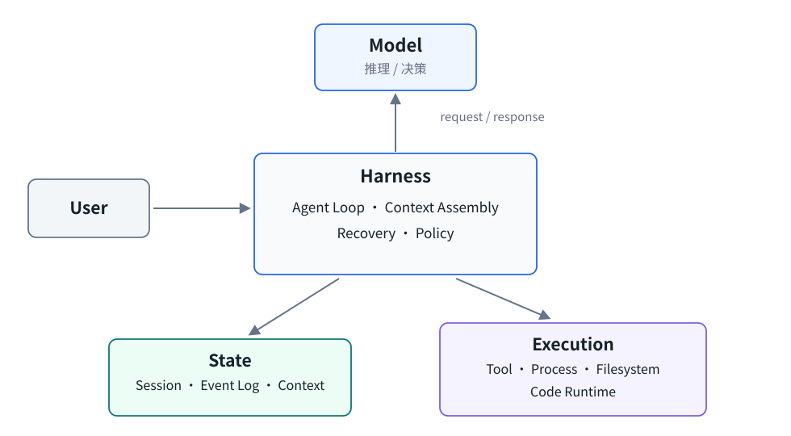</p>
<p align="center"><sub>图 1-1　DeepSeek Harness 的重点变化发生在 Runtime 执行层，而不是模型推理能力本身。</sub></p>

Session、Context、能力 Provider、模型 Provider 和 PTC 都属于这条 Harness 路径。Runtime 的恢复、持久化与进程行为是 Harness 行为，不等同于模型能力。

---

## 2. 这次我们做了哪些实验

### 2.1 为什么分成四层

```text
真实 Agent 任务 W1–W3
        ↓ 发现行为与失败现象
确定性机制实验 W4–W8
        ↓ 隔离具体 Runtime 机制
DSH 白盒实验 W9–W10
        ↓ 验证显式 API / capability seam
CPU 微基准实验 C1–C8
        ↓ 拆解 Host CPU 工作
```

真实任务接近实际使用，但模型输出、网络与执行路径会引入大量变量，因此适合发现现象，不适合单独解释原因。W4–W8 使用固定输入和脚本化模型 Provider 隔离单个机制；W9–W10 直接验证 DSH 的 Session 和文件系统能力接口。确认机制后，C1–C8 再去掉真实模型网络延迟，测量 Host 侧工作。

### 2.2 Harness 行为实验 W1–W10

| 实验 | 测试内容 | 为什么做 | 主要回答的问题 | 主要结果 |
|---|---|---|---|---|
| W1 | Exact File Edit | 最基础基线测试 | 是否能完成明确、可验证的文件修改 | 两侧均完成任务，并通过外部 verifier |
| W2 | Python Bug Fix | 小型真实 Coding Task | 是否具备读代码、修改、测试和验证闭环 | DSH 4/5；OpenClaw 5/5 |
| W3 | Multi-module Feature | 更长的真实执行链 | 是否出现值得进一步隔离的稳定性现象 | DSH 5/5；OpenClaw 2/5，观察到 `incomplete_turn` |
| W4 | Malformed Tool Call | 固定模型 Provider 返回的格式异常事件 | 错误被结构化并继续，还是终止 Turn | DSH 将异常转成模型可见的错误后继续并完成；OpenClaw 固定版本测试场景以 `incomplete_turn` 结束 |
| W5 | Automatic Compaction | 固定长 Tool Result | Compaction 如何触发，之后能否继续 | DSH 与 OpenClaw 在校准后的固定测试场景中均记录到 3 次 Compaction；DSH 3 次压缩后的模型请求体均下降 |
| W6 | Tool Failure | 固定缺少必填参数 / 子进程退出码 17 | 普通 Tool Failure 与格式异常事件是否属于同一边界 | 两侧在缺少必填参数和子进程退出码 17 两类错误后均继续执行 |
| W7 | 长工具调用链 | 连续 20 次 Tool 调用 | Context、模型请求体与 Tool state 如何累积 | 两侧均完成连续 20 次 Tool 调用；历史 Tool Result 均保留，Tool Call 与 Tool Result 配对校验通过；最终一次模型请求分别保留 DSH 20、OpenClaw 20 个 Tool Result |
| W8 | Direct vs PTC | 相同 8 个底层操作 | 模型请求次数下降是否来自编排折叠，而非漏做工作 | DSH 向模型 Provider 发出的请求从 9 次降至 2 次，底层操作仍为 8 个 |
| W9 | Resume / Fork / Replay | DSH Session 白盒实验 | Event Log 如何支持恢复、分支和重放 | 已持久化日志保持一致；无结果的 Tool Call 未被重新执行；Fork 成功；Replay 未访问在线模型 Provider |
| W10 | Filesystem Seam | `local → sandbox → local` | 文件系统能力 Provider 是否为可观察边界 | 本地文件系统能力 Provider 允许 workspace 外写入，Sandbox 文件系统能力 Provider 拒绝；切回本地实现后原行为恢复 |

W1–W3 为真实 Agent 任务；W4–W8 为确定性机制实验；W9–W10 为 DSH 白盒机制实验。W9/W10 没有完全对等的 OpenClaw 实验，因此不用于两套 Runtime 排名。

### 2.3 为什么 W3 之后需要 W4

W1 只验证最基础的 exact edit。W2 是 `Retry-After` parser Bug：Agent 需要运行测试、阅读代码、修改实现并再次验证，DSH 完成 4/5，OpenClaw 完成 5/5。样本数只有 5，实际执行时间分布也不用于性能排名。

W3 要在多个 Python 模块中增加 weighted atomic quota consumption 并补充测试，执行链更长。DSH 完成 5/5，OpenClaw 完成 2/5；部分失败表现为 `incomplete_turn`。这只能说明真实任务里观察到了差异，不能说明差异一定来自某个 Harness 机制。因此 W4 固定模型 Provider 返回的格式异常事件，只观察恢复路径。

### 2.4 CPU 实验 C1–C8

| 实验 | 测什么 | 对应 Runtime 工作 |
|---|---|---|
| C1 | Agent Loop 随 Tool Step 增长 | 控制面 |
| C2 | Event 追加、消息派生、分叉、持久化与加载 | 状态面 |
| C3 | Context JSON 编解码与 SSE 流解析 | 状态处理 / 序列化 |
| C4 | DSH 管理路径、直接单次进程与持久进程 | 进程 / Tool 边界 |
| C5 | 常规 Tool 调用与 PTC | 执行粒度 |
| C6 | 本地文件系统与 Sandbox 文件策略 | 文件系统策略检查 |
| C7 | 1→32 个独立 Agent | 多 Agent 扩展 |
| C8 | TokenMeter 的 Context 大小/压力计量 | Context 管理 |

---

## 3. Everything is a Plugin：把 Runtime 能力变成可组合边界

### 3.1 它解决什么问题

一个 Agent Runtime 同时包含模型调用、工具、文件系统、Session、Context、Sandbox 与 Code Runtime。如果这些能力全部直接固定在 Agent Loop 内部，更换文件系统策略或执行环境时会影响上层调用路径。DSH 希望把“使用能力的组件”和“真正实现能力的组件”分开。

**能力 Provider** 是某项 Runtime capability 的具体实现。使用能力的组件只依赖稳定的 Capability / Service，启动时的 composition 决定实际使用哪个能力 Provider：

```text
Consumer → Capability / Service → Provider
tool-fs  → ctx.fs              → fs-local / fs-sandbox
```

### 3.2 Profile、Bundle、Patch 与 Cordis

Profile 选择有序 Bundle，随后应用 Patch，最终由 Cordis 形成运行中的 Plugin Tree，并注册 `ctx.*` services。

<p align="center">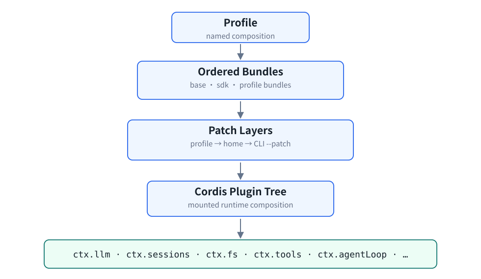</p>
<p align="center"><sub>图 3-1　Everything is a Plugin 不只是源码拆模块；Runtime 在启动阶段由 composition 形成。</sub></p>

- **Profile**：一套命名的 Runtime composition；
- **Bundle**：按顺序加载的一组 Cordis 配置与插件代码；
- **Patch**：来自 profile、home 或 CLI 的覆盖层；
- **Cordis**：承载插件生命周期与 service 注册的 composition framework；
- **`ctx.*`**：插件获取稳定 service/capability 的接口，例如 `ctx.fs`、`ctx.sessions`。

插件化与依赖注入不是 DeepSeek 首创。这里值得关注的是，DSH 把 Model、Session、Tool、Agent Loop 等 Runtime 子系统统一放进同一 composition 模型。

### 3.3 `ctx.fs` 与 W10

`tool-fs` 通过稳定的 `ctx.fs` capability 使用底层能力 Provider；上层 Tool 不变时，能力 Provider 可以在 local 和 sandbox 实现之间替换。

<p align="center">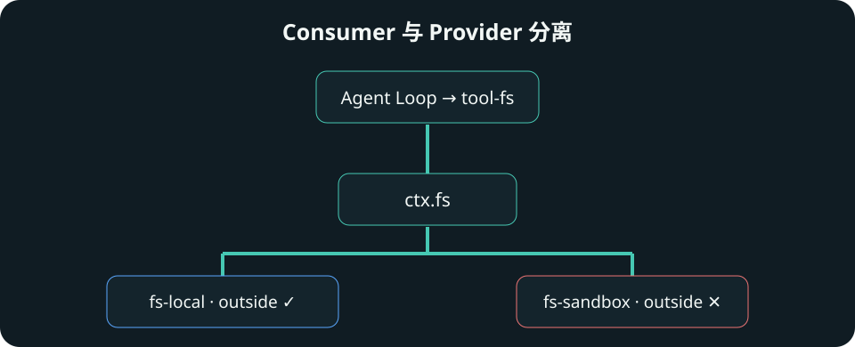</p>
<p align="center"><sub>图 3-2　使用能力的组件与能力 Provider 分离后，替换实现可以改变访问策略，而不改上层 Tool 调用。</sub></p>

**测试目的。** 验证架构文档中的 `ctx.fs` 是否真的是可替换的能力 Provider 边界。

**测试方法。** 保持 Agent Loop、`tool-fs` 和脚本化调用不变，只执行 `fs-local → fs-sandbox → fs-local`。

| 文件系统能力 Provider | workspace 内写入 | workspace 外写入 |
|---|---|---|
| fs-local | 成功 | `OUTSIDE_CHANGED` |
| fs-sandbox | 成功 | `FS_SANDBOX_DENIED` |
| 再切回 fs-local | 成功 | 切回 local 后恢复原有行为 |

**实际结论。** 当前固定版本中，替换 `ctx.fs` 的文件系统能力 Provider 会改变真实的文件系统策略。W10 只直接验证了这一处 capability 边界，不能据此推断所有 capability 都具有相同行为。相关 Host CPU 成本见第 10 章。

---

## 4. Session Event Log：把 Session 建模成执行状态

### 4.1 Model Messages 与 Runtime State

成熟 Agent Runtime 原本就会持久化 Session、Tool Result 或 Transcript。DSH 值得关注的地方，是把 **Session Event Log**——按顺序追加、具有明确类型的执行事件——作为 Session 的核心状态模型，并要求模型输入能够从这条日志派生和重建。

| Model Messages 更关心 | Session Event Log 更关心 |
|---|---|
| 模型下一次需要看到什么 | Runtime 实际发生过什么 |
| user / assistant / Tool 历史 | turn、step、Tool call/result 与生命周期事件 |
| Model Context | 持久执行状态（Durable Execution State） |

`deriveMessages()` 把 Event Log 投影为下一次准备发送给模型的 Context。

### 4.2 Turn、Step 与事件流

**Step** 是一次 Model Request 以及由它产生的 Tool Calls；**Turn** 是一次输入触发的整段执行，可以包含多个 Step。例如第一步运行测试并获得错误，第二步读取源码或提交修改，二者属于同一个 Turn 中的不同 Step。

Turn 由一个或多个 Step 构成；各 Step 产生的类型化事件进入同一条 Session Event Log，并支撑 Context 派生、Resume、Fork 和 Replay。

<p align="center">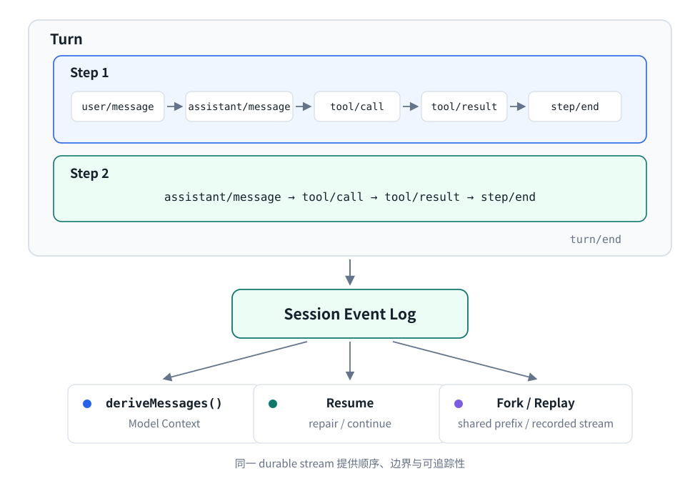</p>
<p align="center"><sub>图 4-1　Model Context 是持久化事件流的一种投影；恢复、分叉和重放依赖明确的日志边界。</sub></p>

### 4.3 W9：Resume、Fork、Replay

**测试目的。** 验证 Event Log 是否真的形成可持久化、可分支、可重放的执行状态，而不只是概念模型。

**测试方法。** W9-A 在日志已经保存 `tool/call`、但尚未出现对应 `tool/result` 时终止进程；W9-B 从一个已经完整结束的 Turn 创建子 Session；W9-C 禁用在线模型 Provider，重放预先记录的模型输出流。

**实验事实。** Crash/Resume 中，已持久化的日志前缀保持不变；已记录但尚无结果的 Tool Call 未被自动重新执行。Runtime 注入 `TOOL_OUTCOME_UNKNOWN`，关闭被中断的 Turn，再从新的 Turn 继续。对有外部副作用的 Tool，这避免了在结果未知时盲目重复执行。

父 Session 与子 Session 在分叉边界派生出的模型消息一致，之后两条日志可以分别追加新事件。Replay 过程中未访问在线模型 Provider；该过程只重建记录的模型输出和执行状态，不会再次执行外部副作用。

**实际结论。** W9 验证的是当前 DSH API 的具体行为。OpenClaw 也存在 Session/Transcript persistence，但本仓库没有完全对等的 OpenClaw W9，不能做有/没有式判断。Event Log 的 Host 状态成本见第 10.1 节。

---

## 5. Context Management：把长 Context 治理放进 Runtime

### 5.1 为什么 Harness 要管理 Context

长期 Agent 会持续累积 user、assistant、Tool Call 和 Tool Result。Runtime 必须判断当前准备发送给模型的 Context 有多大、是否接近预算、哪些信息可以压缩，以及压缩后如何保持下一轮 Model Context 有效。OpenClaw 等 Harness 已经具有 Context Compaction；研究重点不是“DSH 第一次会压缩”，而是 DSH 如何把 TokenMeter 与 Compaction 组织成可组合的 Runtime 能力。

**TokenMeter** 评估当前模型 Context 的大小和压力。**Compaction** 在达到策略边界后生成更小的 Context 表示。`sdk-minimal` 默认没有自动 Compaction；W5 显式加载 `token-meter + compaction-basic`。

压力检查（Pressure Check）根据 TokenMeter 的计量结果选择继续执行或触发 Compaction；TokenMeter 与 Compaction 是显式加载的可选 composition，而非 minimal profile 的隐含能力。

<p align="center">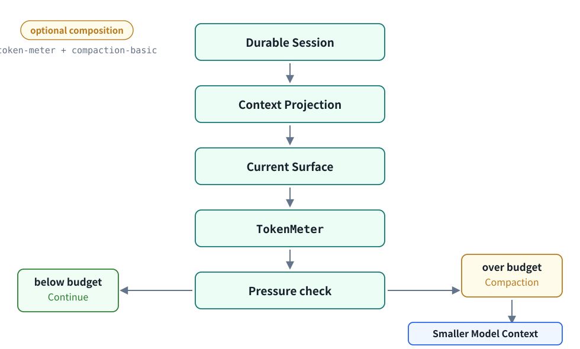</p>
<p align="center"><sub>图 5-1　Context Management 把计量、策略判断和压缩结果放入 Runtime 生命周期。</sub></p>

### 5.2 W5：压缩能否触发并继续

**测试目的。** 验证 Context 增长后 Compaction 是否真实触发，以及压缩后 Agent 能否继续执行。

**测试方法。** 使用确定性 Tool Chain、较大 Tool Result 与固定摘要器（summarizer），记录模型请求、Compaction 请求，以及每次压缩前后的请求体大小。

W5 的 DSH 固定测试场景（fixture）包含 8 次 Tool Call、3 次 Compaction；最终任务正常完成。

| 压缩位置 | 压缩前模型请求体 | 压缩后模型请求体 | 减少量 |
|---|---:|---:|---:|
| 第 4 次模型请求后 | 19,823 B | 15,718 B | 4,105 B |
| 第 6 次模型请求后 | 20,162 B | 15,718 B | 4,444 B |
| 第 8 次模型请求后 | 20,162 B | 15,718 B | 4,444 B |

**实际结论。** 三次压缩后的模型请求体均缩小，任务继续完成。OpenClaw 在校准后的固定测试场景中也记录到 3 次 Compaction，因此 W5 不是证明 DSH“有而 OpenClaw 没有”，而是观察两种 Runtime 如何重新整理模型 Context。TokenMeter 的 CPU 数据见第 10.1 节。

---

## 6. Programmatic Tool Calling：改变 Tool 编排粒度

### 6.1 Direct 与 PTC

Direct Tool Calling 中，每个 Tool 都经过 Model Request、Tool Call、Runtime Dispatch、Tool Result、Context 重建和下一次 Model Request。**Programmatic Tool Calling（PTC）** 则让模型生成一个 Program，由本地 Runtime 在单个外层调用内连续调用多个 Tool，再把 Program Result 返回模型。

Direct 模式逐次向模型暴露 Tool Call/Result；PTC 则把多个 Tool 调用封装在一次 Program 执行边界内。底层 Tool 工作保持不变，变化的是模型可见的编排粒度。

<p align="center">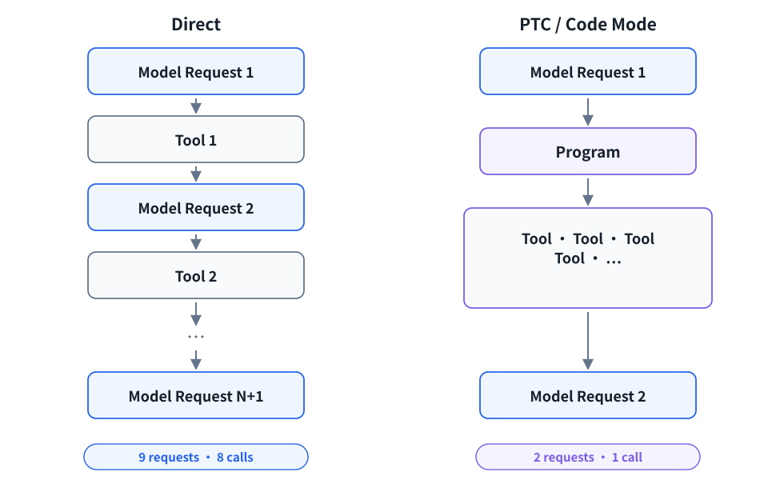</p>
<p align="center"><sub>图 6-1　PTC 不减少底层 Tool 工作，减少的是模型层反复进入 Tool 调用流程的次数。</sub></p>

让模型生成代码并在本地执行多个操作不是整个 Agent 行业首次出现。DSH 值得关注的是把 PTC 明确设计为 Runtime 的 Tool Presentation / Execution Mode（工具呈现与执行模式），并通过正式 Code Runtime 与 Tool Pipeline 执行。

### 6.2 W8：确认没有漏做 Tool

**测试目的。** 排除“PTC 的模型请求更少只是因为少做了 Tool”的可能。

这里的**模型可见调用**指模型直接发出的 Tool 或 Program 调用；**模型 Provider 请求**指 Harness 向模型 Provider 发起的一次请求。

**测试方法。** 固定 8 个底层 shell 操作，要求顺序严格一致、每个恰好执行一次；Direct 让模型逐个调用，PTC 则由一个 Program 调度全部操作。

| DSH 模式 | 底层操作 | 模型可见调用 | 向模型 Provider 发出的请求 |
|---|---:|---:|---:|
| Direct | 8 | 8 | 9 |
| PTC | 8 | 1 | 2 |

**实验事实。** DSH 的模型请求体总量下降 70.6%；OpenClaw 的构造对照也从 9 次模型请求降到 2 次，请求体总量下降 74.1%。

**实际结论。** 变化来自执行粒度，而不是漏做工作。这不是实际模型质量或端到端任务延迟提升的证明；常规 Tool 调用与 PTC 的本地 CPU 成本见第 10.2 节。

---

## 7. 机制洞察：错误边界如何影响恢复

错误恢复本身不是 DeepSeek 首创功能。本章关注的是错误边界与恢复语义（Error Boundary Semantics）：同一种失败在哪一层被结构化，会决定模型是否获得下一次修复机会。

```text
W3 真实任务观察 incomplete_turn
        ↓ 存在模型随机性等混杂变量
W4 固定模型 Provider 返回的格式异常事件
        ↓ 只观察 Harness 恢复路径
W6 固定格式正常的 Tool Failure
        ↓ 区分模型 Provider 事件与 Tool 执行边界
```

在模型 Provider 返回相同格式异常事件时，DSH 和当前固定版本 OpenClaw 进入了不同的 Runtime 处理路径。

<p align="center">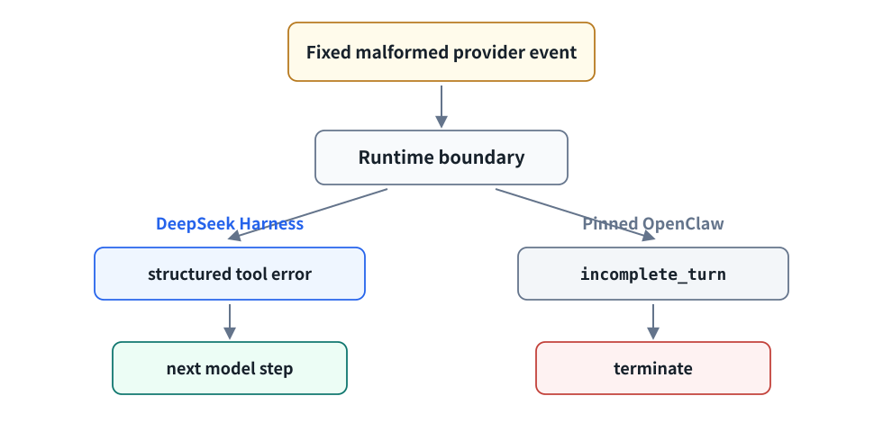</p>
<p align="center"><sub>图 7-1　错误能否成为可反馈给模型的信息，决定当前 Turn 是否有机会进入下一 Step。</sub></p>

### 7.1 W4 与 W6 为什么不重复

**W4 测试目的。** 固定 Tool 名称为空、参数 JSON 被截断的 Tool Call，只观察模型 Provider 返回的格式异常事件如何被处理。

**W4 实验事实。** DSH 将其转成结构化的 Tool 调度错误，并在第 2 次模型请求后完成；当前固定版本 OpenClaw 的测试场景在 1 次模型请求后以 `incomplete_turn` 终止。

**W6 测试目的。** 检查格式正常的 Tool Error 是否也存在同样差异。测试分别固定“缺少必填参数”和“子进程以退出码 17 结束”；两侧在缺少必填参数和子进程退出码 17 两类错误后均继续执行。

**实际结论。** 模型 Provider 返回的格式异常事件与格式正常的 Tool Failure 位于不同错误边界，不能合并成一个“Runtime 稳定性”指标。W4 只能证明两套固定版本 Runtime 对固定输入的处理行为不同，不能外推为 DSH 全面更可靠。

---

## 8. DeepSeek Harness 与 OpenClaw 的主要差异

OpenClaw 是参照 Runtime，不是被打分的“旧框架”。下表先回答两边是否都有相关能力，再说明 DSH 的组织方式与实验边界。

| 维度 | 两边都有相关能力吗 | DSH 值得关注的设计 | 当前实验实际验证 |
|---|---|---|---|
| 插件与扩展机制 | 是，各有扩展路径 | everything-is-a-plugin + Cordis composition + `ctx.*` seam | W10 直接验证 `ctx.fs`，不代表所有 seam |
| Session 持久化 | 是 | 类型化的只追加 Event Log 作为核心 Session state | W9 验证 DSH Resume/Fork/Replay；无对等 OpenClaw W9 |
| Context 压缩 | 是 | TokenMeter / Compaction 作为可组合 capability | W5 验证显式加载后的路径；两侧预算与估算方法不等价 |
| Tool 执行 | 是 | PTC 是明确的 execution model | W8 比较 Direct/Code 两种模式，不作产品完整性排名 |
| 错误恢复 | 是 | 关注模型 Provider 事件与 Tool 执行边界的结构化处理行为 | W4/W6 只覆盖固定输入 |
| Sandbox / Policy | 是 | 能力 Provider 可由 composition 替换 | W10 只验证 filesystem seam |

因此，本报告不支持“DSH 全面优于 OpenClaw”。它支持的是：当前 DSH 把 composition、Event Log、Context Management 与 PTC 明确提升为 Runtime 设计中心；两套固定版本 Runtime 在若干固定边界上呈现可观察差异。

---

## 9. 这些设计为什么会影响 Host CPU

前面的 W 系列回答“Runtime 怎么工作”；C 系列进一步测量这些机制在 Host 侧形成的工作。

| Harness 机制 / 现象 | W 证据 | 形成的 Host 工作 | CPU 证据 |
|---|---|---|---|
| Capability Seam（能力边界） | W10 | 文件路径处理、Policy 检查 | C6 |
| Session Event Log | W9 | 事件追加、分叉、持久化与加载 | C2 |
| Context Management | W5 | Context 序列化、大小与压力计量 | C3 / C8 |
| PTC / Code Mode | W8 | 本地 Program 执行与编排粒度 | C5 |
| Tool / Process 生命周期 | — | 进程创建、等待与复用 | C4 |
| 错误恢复语义 | W4 / W6 | 可能增加 Agent Loop 与模型请求 | 未单独测量 |
| 多 Agent 并发扩展 | — | 并发调度和内存占用 | C7 |

这些 CPU 实验用于说明软件机制会形成哪些 Host 工作，不用于处理器排名。当前数据来自单一 aarch64 主机、固定拓扑与确定性测试场景。

---

## 10. Host CPU 与运行时开销

前面的实验主要验证 DeepSeek Harness 如何组织状态和执行。进一步观察 Host 侧开销，可以看到这些设计并不只有软件结构上的变化：Session 和 Context 状态越大，本地处理工作越多；Tool 越碎，进程和编排开销越明显；PTC 会改变本地执行粒度；多个 Agent 并发时，还会带来额外的 CPU 和内存压力。

C1 还表明，随着 Agent Step 增多，Agent Loop 本身以及同步增长的 Session/Context 会形成持续增加的本地 CPU 工作。由于两者在当前测试中同时增长，C1 不能解释为纯 Agent Loop 的单步开销。

### 10.1 Session / Context 状态越大，Host 处理成本越高

Agent 执行过程中会持续产生 Session Event、Tool Result 和 Context。随着需要保存、整理或发送给模型的状态规模增大，Runtime 的本地处理工作也会增加。Compaction 可以缩小模型可见的 Context，因此不能简单理解为 Agent 运行时间越长，当前 Context 就一定越大。

C3 使用相同规模的测试数据分别测量请求 JSON 编解码和模拟响应的流式解析路径。测试数据达到 16 MiB 时，JSON 编码约需 15.43 ms CPU 时间，JSON 解码约需 10.71 ms，SSE 流解析与 JSON 解码路径约需 41.94 ms。SSE（Server-Sent Events）是 LLM API 常用的 HTTP 流式传输格式，Harness 需要从中解析携带模型增量或 Tool Event 的 JSON 数据。

<p align="center">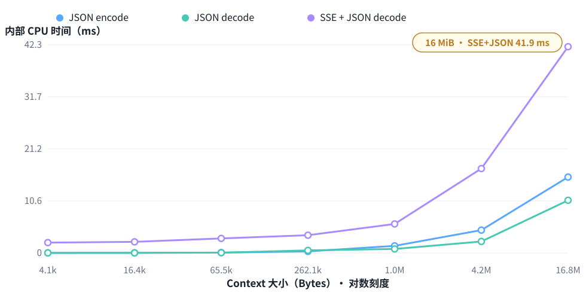</p>
<p align="center"><sub>图 10-1　随着测试数据增大，本地 JSON 编解码以及 SSE 流解析与 JSON 解码的 CPU 时间均随之增加。</sub></p>

C8 比较了三种 Context 计量路径：**Cold** 表示第一次从已有 Session 历史建立 TokenMeter 状态；**Incremental** 表示在已有状态上新增一段 Context 后继续计量；**Warm Repeat** 表示 Context 不变、计量状态已经同步时重复计量。

三种路径的 CPU 成本都会随着 Context 规模增加。在 C8 最大的一组 Context 测试规模下，Cold 单次计量约需 186.6 ms，Incremental 约需 12.5 ms，Warm Repeat 约需 11.6 ms。这说明首次从完整历史建立计量状态明显更重；状态建立后，Incremental 与 Warm Repeat 在当前固定测试场景中的成本已经比较接近。三种测量窗口的操作并不完全相同，不能将这些数值理解为可互换的端到端延迟。

<p align="center">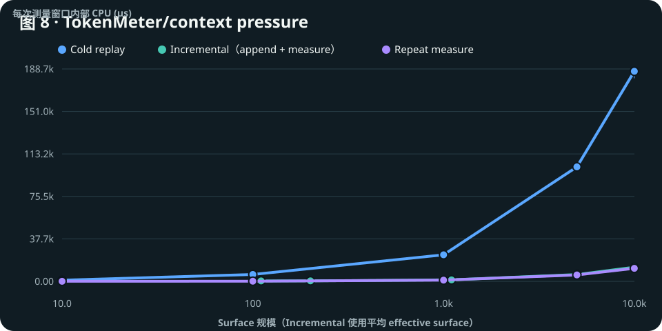</p>
<p align="center"><sub>图 10-2　Cold 路径明显高于已有状态下的 Incremental 和 Warm Repeat；后两者在大 Context 下成本接近。</sub></p>

C2 还确认了 Session 的追加、分叉、持久化和加载本身都有独立 CPU 成本。Incremental 的横轴按计量过程中实际经历的平均 Context 规模计算。这些数字来自当前固定测试场景，不等同于生产端到端延迟；C8 测量的是 DSH TokenMeter 的 Context 大小和压力计量路径，不是分词器性能测试。

### 10.2 Tool 很短时，执行 Tool 的外围开销可能更明显

如果 Tool 自己只需要很短时间，但 Runtime 每次都要创建进程、建立进程间通信管道、等待退出、记录结果并再次进入 Agent Loop，那么真正耗时的可能不是 Tool 本身，而是 Tool 周围的执行边界。

C4 使用非常短的命令比较三种进程执行方式。**DSH 管理路径**通过 Harness 的正常进程管理流程执行；**直接单次进程**绕过 DSH 管理封装，每次直接启动一个新进程，执行一次后退出；**持久进程**则保持同一个 Shell 进程运行，后续操作复用该进程。后两者用于拆分进程创建和 Runtime 管理成本，不代表 OpenClaw 的实现。

在 1000 次微操作下，**DSH 管理路径约为 3.91 ms/op，直接单次进程约为 2.76 ms/op，持久进程约为 0.064 ms/op**。

<p align="center">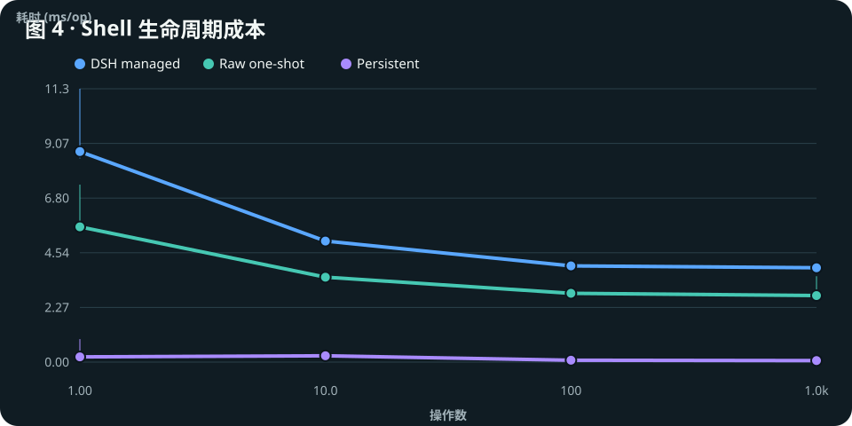</p>
<p align="center"><sub>图 10-3　对于执行时间很短的 Tool，反复创建进程和经过 Runtime 管理路径会形成明显的额外开销；复用长期运行进程可以显著减少这部分成本。</sub></p>

这也解释了 PTC 为什么值得关注。这里的**常规 Tool 调用**是 DSH 不使用 PTC 时的正常 Agent Loop 路径，并非 native code；PTC 则先启动一个本地 Program Worker——执行 Program 并连续调用 Tool 的本地进程。PTC 不是让单个 Tool 变快，而是减少重复进入 Model/Harness 编排链路的次数。

PTC 每次都要先启动 Program Worker，因此存在固定启动成本。在当前测试中，64 次操作时常规 Tool 调用约需 138 ms，PTC 约需 159 ms，常规调用仍然更快；到 256 次操作时，常规调用约需 479 ms，PTC 约需 277 ms，PTC 已经更快。因此，两种方式的性能反转发生在 64～256 次操作之间。这个区间只属于当前固定微基准，不是生产环境切换到 PTC 的阈值。

<p align="center">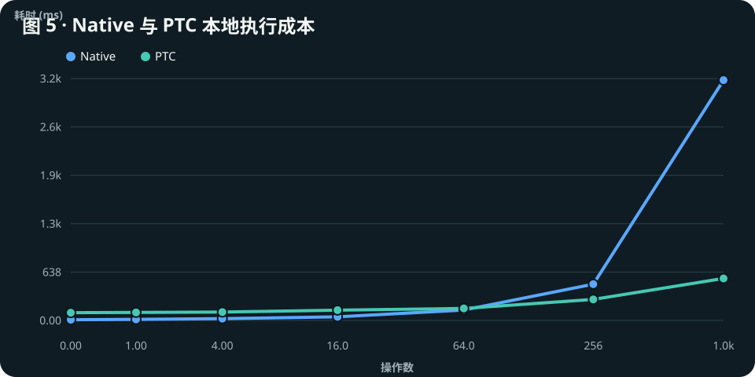</p>
<p align="center"><sub>图 10-4　PTC 有固定启动成本；随着连续 Tool 操作增加，减少重复 Agent/Runtime 编排所节省的时间开始超过这部分成本。</sub></p>

### 10.3 Sandbox / Policy 也会产生实际 CPU 工作

W10 中，换成 `fs-sandbox` 后，Harness 会检查路径是否位于允许范围内。这样的检查需要路径规范化、确认目标路径是否在允许范围内，并执行最终策略判断，因此也会消耗 CPU。

C6 中，1000 次允许写入时，sandbox/local 的执行时间比约为 1.06 倍，CPU 时间比约为 1.10 倍。这里测的只是 DSH 文件系统策略检查，不是完整 VM、container、Firecracker 或远程 E2B sandbox 的成本。

### 10.4 多个 Agent 同时运行后，问题不再只是单任务速度

单个 Agent 时通常关注一次任务需要多久；当一台机器同时运行几十个 Agent 时，还需要关注总吞吐、并行效率和每个 Runtime 占用的内存。并行效率表示增加 Agent 数后，实际吞吐提升相对于理想线性扩展的程度。

C7 中，32 个独立 Agent 进程达到约 83.17 Agents/s，并行效率约为 72.8%。各 Agent 子进程各自最大驻留内存（RSS）的累加值约为 2.07 GiB，单个子进程最高约为 71.4 MiB；该累加值不是同一时间点的整机内存占用。

<p align="center">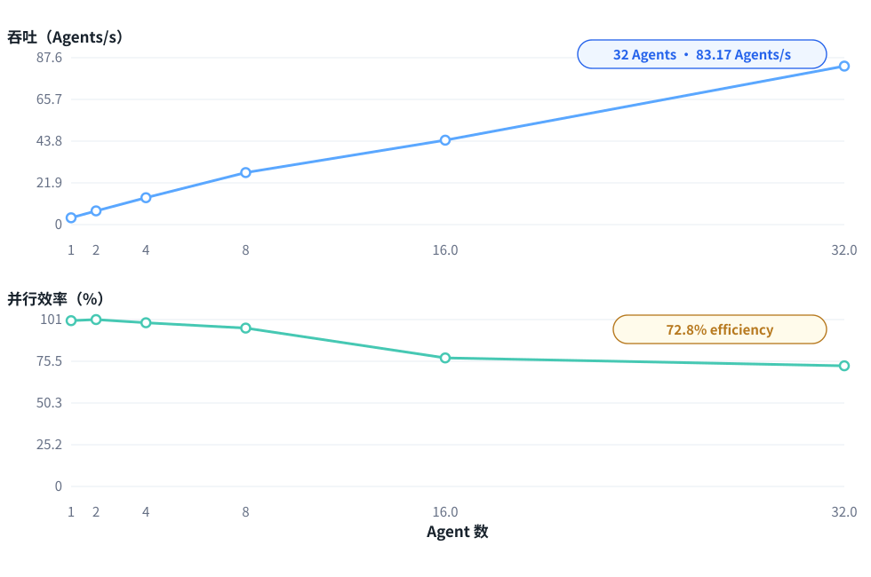</p>
<p align="center"><sub>图 10-5　多个独立 Agent 并发运行时的总吞吐与并行效率。</sub></p>

因此，多 Agent 部署最终会同时受到 CPU 核数、调度和内存容量影响。固定单机结果不支持 ARM/x86、厂商或生产部署排名。

---

## 11. 总结

DeepSeek Harness 当前版本最值得研究的，不是某个孤立“新功能”，而是一套更显式的 Agent Runtime 组织方式：

1. Everything is a Plugin 把 Runtime 能力组织为可组合、可替换的边界；
2. Session Event Log 把 Agent 的执行过程保存为结构化事件流，模型 Context 可以从日志派生；
3. Context Management 把 Context 大小计量和压缩放进 Runtime；
4. PTC 把多次模型可见的 Tool 调用合并进一次本地 Program 执行；
5. W4/W6 表明，错误在哪一层被结构化，会影响 Agent 是否获得继续恢复的机会。

这些概念并非全部由 DeepSeek 在 Agent 行业首次提出。DSH 的特点在于把组合、状态和执行机制放进统一的 Runtime 组织方式，并使这些边界成为可以单独观察和验证的架构对象。W1–W10 提供从真实任务到白盒机制的证据链；C1–C8 则说明这些抽象最终会落成控制、状态、执行与规模四类 Host 工作。

**因此，本次调研最重要的结论不是哪套 Harness 赢了，而是 DeepSeek Harness 把组合、状态和执行边界提升成了更显式的架构对象；这些边界既可以通过机制实验验证，也会进一步形成可测的 Host workload。**
